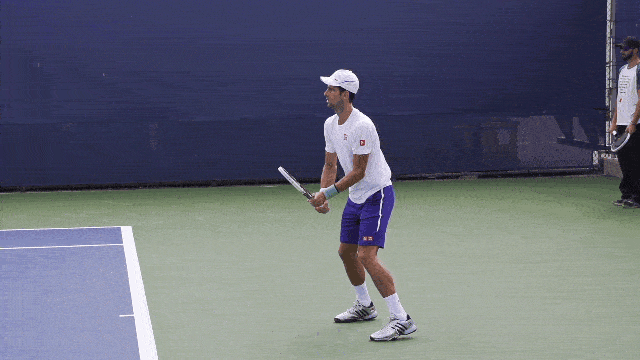
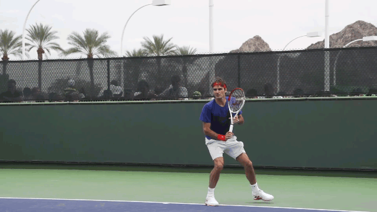
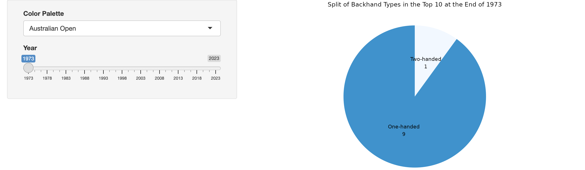
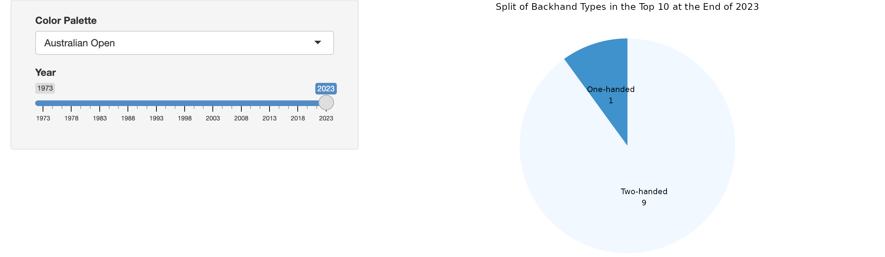
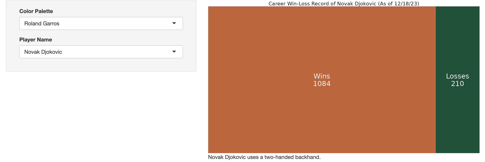
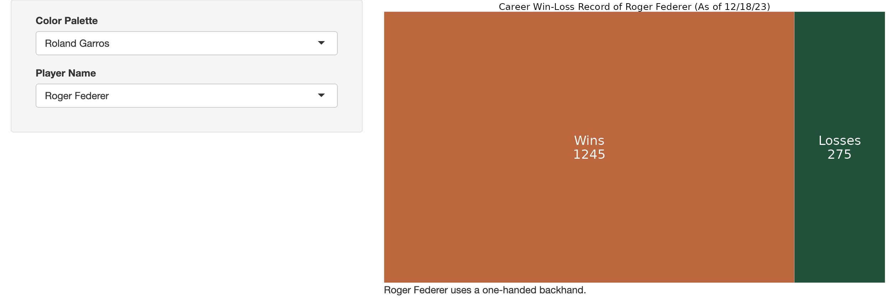

```{r setup, include=FALSE}
knitr::opts_chunk$set(echo=FALSE, highlight=FALSE)

setwd('/Users/karminaob/Documents/UVA/3280/3280 Project')
library(tidyverse)
library(ggplot2)
library(plotly)
```

## What is the one-handed backhand? 
In tennis, the backhand is a groundstroke used when the player has to hit a ball on the side of their non-dominant hand. 

Some use two hands for their backhand, like Novak Djokovic.



Others use one hand for their backhand, like Roger Federer.



The ATP, or the Association of (Male) Tennis Professionals, started their singles rankings in 1973. Every week since then, at least one player in the Top 10 used a one-handed backhand. However, this was no longer the case after February 19, 2024. What does this mean for the one-handed backhand?

## The one-handed backhand is an older technique.
### Split of Backhand Types in the Top 10 Each Year
Fewer players in the top 10 use a one-handed backhand now than in years past. This is evident using the following link: <https://kob4zh.shinyapps.io/project_p1/>





At the end of 1973, 9 out of the top 10 players used a one-handed backhand, but at the end of 2023, only 1 out of the top 10 players used a one-handed backhand. 

This comparison extends past the top 10. There are fewer one-handed backhands than two-handed backhands across all professionals.

### Average Age of One-Handed vs. Two-Handed Backhand Users (2023)
Looking at the top 100 players at the end of 2023, one-handed backhand users were older, on average.

```{r}
us_open <- c('#042c8c', '#dea739')

# End-of-2023 rankings using player IDs
eo23_ranks_id <- read.csv('atp_rankings_current.csv') 
# Names and IDs of players (Week of 3/25/24)
players <- read.csv('atp_players.csv')
# Names of players who use a one-handed backhand (Week of 3/25/24)
ohb_players <- read.csv('ohb_players.csv')

# Add end-of-2023 age to players data set
players$dob <- as.Date(as.character(players$dob), format='%Y%m%d')
eo23_date <- as.Date('20231231', format='%Y%m%d')
players$age <- floor(as.numeric(difftime(eo23_date, players$dob, units='days') / 365.25))

# Create end-of-2023 top 100 using players' full names
players$name <- paste(players$name_first, players$name_last)
eo23_ranks <- eo23_ranks_id %>%
  left_join(players, by=c('player'='player_id')) %>%
  select(rank, name, age) %>%
  head(100)

# Add a column to eo23_ranks with players' backhand type
eo23_ranks$backhand <- ifelse(eo23_ranks$name %in% 
                                   ohb_players$name, 
                                 'One-handed',
                                 'Two-handed')

# Extract 2023 (until 09/11) ATP match statistics of interest
match_stats <- read.csv('charting-m-stats-Overview.csv')
match_stats <- match_stats %>% 
  separate(match_id, 
           c('match_date', 
             'match_gender', 
             'match_tournament',
             'match_round',
             'player_1',
             'player_2'),
           sep='-') %>%
  filter(match_date > 20221231)
match_stats$player_1 <- gsub("_", " ", match_stats$player_1)
match_stats$player_2 <- gsub("_", " ", match_stats$player_2)
match_stats$name <- ifelse(match_stats$player==1, 
                           match_stats$player_1,
                           match_stats$player_2)
bh_match_stats <- match_stats %>%
  filter(set=='Total') %>%
  select(name, winners_bh, unforced_bh)

# Average 2023 (until 09/11) ATP match statistics of interest by player
bh23_stats <- aggregate(cbind(winners_bh, unforced_bh) ~ name, 
                        bh_match_stats, 
                        mean)

# Data set 1 with rank, name, age, backhand type, average 2023 (until 
# 09/11) backhand winners, and average 2023 (until 09/11) backhand 
# unforced errors, including NAs 
df1 <- eo23_ranks %>%
  left_join(bh23_stats, by='name')

# Averaging age by backhand type
df1.5 <- aggregate(age ~ backhand,
                   df1, 
                   mean)

# Create plot
p2 <- ggplot(df1.5, aes(x=backhand, y=age, fill=backhand)) +
  geom_bar(stat='identity') +
  coord_cartesian(ylim=c(0, 40)) +
  geom_text(aes(label=round(age,2)), vjust=0) +
  scale_fill_manual(values=us_open) +
  labs(x='Backhand Type', 
       y='Average Player Age', 
       title='Average Age of One-handed vs. Two-handed Backhand Users (2023)') +
  theme_bw() +
  theme(legend.position='none',
        plot.title=element_text(hjust=0.5))
p2
```

The average age of one-handed backhand users was 30, and the average age of two-handed backhand users was 26.44.

### Distribution of Age of One-handed vs. Two-handed Backhand Users (2023)
Analyzing the spread of age for each backhand type accentuates the difference.

```{r}
p3 <- ggplot(df1, aes(x=backhand, y=age, fill=backhand)) + 
  geom_boxplot(outlier.color='red') +
  coord_cartesian(ylim=c(0, 40)) +
  scale_fill_manual(values=us_open) +
  labs(x='Backhand Type', 
       y='Player Age',
       title='Distribution of Age of One-handed vs. Two-handed Backhand Users (2023)') +
  theme_bw() +
  theme(legend.position='none',
        plot.title=element_text(hjust=0.5))
p3
```

75% of one-handed backhand users are older than the younger half of two-handed backhand users. Therefore, one-handed backhand users are much older than two-handed backhand users.

One-handers are decreasing in numbers on tour and increasing in age, so one can conclude that the one-handed backhand was more common in the past.

## Which backhand performs better?
### Career Win-Loss Records of the Top 50 GOATs (As of 12/18/2023)
The career win-loss records of notable players, as of December 18, 2023, can be explored using the following link: <https://kob4zh.shinyapps.io/project_p4/>





The example above shows that two-hander Novak Djokovic has a higher winning percentage than one-hander Roger Federer. However, another example shows that two-hander Andre Agassi has a lower winning percentage than one-hander Pete Sampras. Thus, while backhands are crucial to the sport, it is unlikely that a player's backhand type is the sole determining factor of their match results.

### High-level Tournament Winners (2021-Early 2024)
The following map considers the ATP Masters 1000, ATP Finals, and Grand Slam tournaments from the start of 2021 to now (early 2024):

```{r}
# Create data set on ATP Masters 1000s, ATP Finals, and Grand Slam tournaments
tournaments <- read.csv('high-level_tournaments.csv')

# Specify sizes and colors for the plot
tournaments$size <- ifelse(tournaments$category=='Grand Slam', 
                           24,
                           ifelse(tournaments$category=='ATP Finals',
                                  16, 
                                  8))

tournaments$bh_col <- ifelse(tournaments$backhand=='One-handed',
                             '#042c8c',
                             '#dea739')

p5 <- plot_ly(data=tournaments,
               type='scattergeo',
               mode='markers',
               lat=~latitude,
               lon=~longitude,
               text=~paste("City:", city,
                           "<br>Tournament:", tournament,
                           "<br>Category:", category,
                           "<br>Winner's Name:", winner,
                           "<br>Winner's Backhand Type:", backhand),
               hoverinfo='text',
               marker=list(size=~size, color=~bh_col),
               frame=~year) %>%
  animation_opts(1500) %>%
  layout(title='High-level Tournament Winners (2021-Early 2024)',
         geo=list(scope='world',
                  projection=list(type='mercator'),
                  showland=TRUE,
                  landcolor='lightgray',
                  coastlinecolor='lightgray'),
         showlegend=FALSE,
         updatemenus = list(
           list(
             type = "buttons",
             showactive = FALSE,
             x = 1.12,
             y = -.18,
             buttons = list(
               
               list(
                 label = "Pause",
                 method = "animate",
                 args = list(NULL, list(frame = list(duration = 0,
                                                     redraw = TRUE),
                                        mode = "immediate"))
               )
             )
           )
         ))
p5
```

High-level tournament winners are mostly two-handers. This fact supports the argument that the two-handed backhand is better. However, one-handers make up a small percentage of professional tennis players in the 2020s, so this is likely due to there being fewer one-handers participating in high-level tournaments.

### Average Backhand Winners vs. Unforced Errors Across 2023 Matches
To isolate backhand performance, one can look at that side's winners and unforced errors. For context, a winner is any shot that is made and ends the point (e.g., landing a ball in bounds but out of the opponent's reach). On the other hand, an unforced error is any shot that is missed because of a player's own mistake (e.g., hitting a ball out of bounds, hitting a ball into the net). 

The following scatterplot considers all matches played by the end-of-2023 top 100 from the beginning of the year to September 11:

```{r}
# Data set 2 with rank, name, age, backhand type, average 2023 (until 
# 09/11) backhand winners, and average 2023 (until 09/11) backhand 
# unforced errors, excluding NAs 
df2 <- drop_na(df1)

# Create plot
p6 <- plot_ly(data=df2, 
              x=~winners_bh,
              y=~unforced_bh,
              color=~backhand,
              colors=us_open,
              text=~paste('Name:', name, 
                          '<br>Year-end Ranking:', rank,
                          '<br>Average Winners:', round(winners_bh,2),
                          '<br>Average Unforced Errors:', round(unforced_bh,2)),
              hoverinfo='text',
              type='scatter',
              mode='markers') %>% 
  layout(xaxis=list(title='Average Winners'),
         yaxis=list(title='Average Unforced Errors'),
         title='Average Backhand Winners vs. Unforced Errors Across 2023 Matches',
         legend=list(title=list(text='Backhand Type')))
p6
```

The player with the highest match-average backhand winners was Andy Murray, a two-hander. The player with the highest match-average unforced errors was Grigor Dimitrov, a one-hander. This can indicate that the two-handed backhand is better, but compared to the rest of the players, Dimitrov also had a high number of match-average backhand winners. Therefore, it is important to analyze the distribution of this data as well.

### Distribution of Average Backhand Winners Across 2023 Matches
```{r}
p7 <- ggplot(df2, aes(x=backhand, y=winners_bh, fill=backhand)) + 
  geom_boxplot(outlier.color='red') +
  scale_fill_manual(values=us_open) +
  labs(x='Backhand Type', 
       y='Average Winners',
       title='Distribution of Average Backhand Winners Across 2023 Matches') +
  theme_bw() +
  theme(legend.position='none',
        plot.title=element_text(hjust=0.5))
p7
```

The median of average winners is higher for one-handers than two-handers. This implies that a one-handed backhand is more likely to produce a winning shot.   

### Distribution of Average Backhand Unforced Errors Across 2023 Matches
```{r}
p8 <- ggplot(df2, aes(x=backhand, y=unforced_bh, fill=backhand)) + 
  geom_boxplot(outlier.color='red') +
  scale_fill_manual(values=us_open) +
  labs(x='Backhand Type', 
       y='Average Unforced Errors',
       title='Distribution of Average Backhand Unforced Errors Across 2023 Matches') +
  theme_bw() +
  theme(legend.position='none',
        plot.title=element_text(hjust=0.5))
p8
```

The median of average unforced errors is higher for two-handers than one-handers. This implies that a two-handed backhand is more likely to produce an unforced error.

Although the scatterplot makes arguments for the two-hander being better, the boxplots make arguments for the one-hander being better. After exploring the data, it appears that neither backhand type performs significantly better than the other. Then, as time goes on, why does it seem that fewer people are using the one-handed backhand?

## Modern court surfaces do not seem to favor the one-handed backhand.
### Court Pace Index Across Tournaments (2013-2019)
Court Pace Index is a measure of how fast a surface plays. For example, playing tennis on grass is considered faster because the ball does not bounce as high, so the player has to rush to get to it.

The following table shows how court surfaces are classified according to their court pace index:

```{r}
col1 <- c('Slow', 'Medium-Slow', 'Medium', 'Medium-Fast', 'Fast')
col2 <- c('<29', '30-34', '35-39', '40-44', '>44')
t1 <- cbind(col1, col2)
colnames(t1) <- c('Court Classification', 'Court Pace Index')
t1
```

The following bar graph shows the court pace index for four high-level hard court tournaments from 2013 to 2019:

```{r}
ball <- '#dfff4f'

# Read in data set created
hard_cpi <- read.csv('hard_cpi.csv')

# Create plot
p9 <- plot_ly(data=hard_cpi,
              x=~tournament,
              y=~cpi,
              frame=~year,
              type='bar',
              text=~cpi,
              textposition='auto',
              marker=list(color=ball)) %>%
  animation_opts(1500) %>% 
  layout(xaxis=list(title='Tournament'),
         yaxis=list(title='Court Pace Index', range=c(0, 45)),
         title='Court Pace Index Across Tournaments (2013-2019)',
         showlegend=FALSE,
         updatemenus = list(
           list(
             type = "buttons",
             showactive = FALSE,
             x = 1.12,
             y = -.18,
             buttons = list(
               
               list(
                 label = "Pause",
                 method = "animate",
                 args = list(NULL, list(frame = list(duration = 0,
                                                     redraw = TRUE),
                                        mode = "immediate"))
               )
             )
           )
         ))
p9
```

In 2013, all four court surfaces were considered medium-slow. As tournaments renovate their courts, the surfaces seem to get faster. In 2019, two court surfaces were considered medium, and the other two court surfaces were considered medium-fast. 

### High-level Tournament Surfaces (2023)
The most common court surfaces from slowest to fastest are as follows: clay, outdoor hard, indoor hard, and grass. The following map considers the ATP Masters 1000, ATP Finals, and Grand Slam tournaments in 2023:

```{r}
# Specify colors for the plot
tournaments$sf_col <- ifelse(tournaments$surface=='Outdoor Hard',
                             '#1592d1',
                             ifelse(tournaments$surface=='Clay',
                                    '#c76131',
                                  ifelse(tournaments$surface=='Grass',
                                         '#047444',
                                         '#042c8c')))

p10 <- plot_ly(data=tournaments,
               type='scattergeo',
               mode='markers',
               lat=~latitude,
               lon=~longitude,
               text=~paste("City:", city,
                           "<br>Tournament:", tournament,
                           "<br>Category:", category,
                           "<br>Surface:", surface),
               hoverinfo='text',
               marker=list(size=~size, color=~sf_col)) %>%
  layout(title='High-level Tournament Surfaces (2023)',
         geo=list(scope='world',
                  projection=list(type='mercator'),
                  showland=TRUE,
                  landcolor='lightgray',
                  coastlinecolor='lightgray'))
p10
```

According to the map, most courts are relatively slow. However, these relatively slow courts are increasing in pace. In general, because a one-handed backhand takes longer to set up for, a slower court surface is more favorable. Therefore, the one-handed backhand is becoming less favorable.

To note, Roger Federer, a one-hander, was known for doing his best on indoor hard and grass courts, so it is possible for the one-handed backhand to succeed on fast courts.

## What will happen to the one-handed backhand?
The one-handed backhand has returned to the Top 10 as of April 1, 2024.

Although it is an older technique, it does not seem to yield significantly worse results than the two-handed backhand. However, considering increasing court pace, the one-handed backhand is less preferable. Therefore, as tennis is evolving, new players are more likely learning and perfecting the two-handed backhand. As a result, two-handers are more likely to dominate the professional tour.

The fate of the one-handed backhand depends on how tennis will change, what coaches will teach, and what new players will perfect. Despite the two-handed backhand being known for its power and control, the one-handed backhand is commonly known as the most aesthetic shot.

As of now, the one-handed backhand is not going anywhere.

## References
*ATP one-hand backhand rankings*. (2024, March 25). Tennis Abstract. <https://tennisabstract.com/reports/oneHandBackhandRankings.html>

Berkok, J. (2024, February 19). *There are no one-handed backhands in the top 10 for the first time in ATP rankings history*. Tennis.com. <https://www.tennis.com/news/articles/no-one-handed-backhands-in-the-top-10-for-the-first-time-in-atp-rankings-history>

*Complete themes*. (n.d.). ggplot2. Retrieved April 16, 2024, from <https://ggplot2.tidyverse.org/reference/ggtheme.html>

*Ggplot2 box plot: Quick start guide - R software and data visualization*. (n.d.). STHDA. Retrieved April 16, 2024, from <http://www.sthda.com/english/wiki/ggplot2-box-plot-quick-start-guide-r-software-and-data-visualization>

*Ggplot2 piechart*. (n.d.). R Graph Gallery. Retrieved April 16, 2024, from <https://r-graph-gallery.com/piechart-ggplot2.html>

Glorfindel. (2019, August 11). *How to put labels over geom_bar in R with ggplot2*. Stack Overflow. <https://stackoverflow.com/questions/6455088/how-to-put-labels-over-geom-bar-in-r-with-ggplot2>

*GOAT list*. (n.d.). Ultimate Tennis Statistics. Retrieved April 18, 2024, from <https://www.ultimatetennisstatistics.com/goatList>

*Latitude and longitude finder*. (n.d.). LatLong.net. Retrieved April 18, 2024, from <https://www.latlong.net/>

*Official site of men's professional tennis*. (n.d.). ATP Tour. Retrieved April 16, 2024, from <https://www.atptour.com/en>

*Pie chart with percentages in ggplot2*. (n.d.). R CHARTS. Retrieved April 16, 2024, from <https://r-charts.com/part-whole/pie-chart-percentages-ggplot2/>

*Plotly r graphing library in R*. (n.d.). Plotly. Retrieved April 16, 2024, from <https://plotly.com/r>

Radecic, D. (n.d.). *Introduction to R Shiny reactivity with hands-on examples*. Appsilon. Retrieved April 16, 2024, from <https://www.appsilon.com/post/r-shiny-reactivity>

Sackmann, Jeff. (2023). *tennis_atp* (1e66fa6) [Data set]. Github. <https://github.com/JeffSackmann/tennis_atp>

Sackmann, Jeff. (2023). *tennis_MatchChartingProject* (e5bf7a2) [Data set]. Github. <https://github.com/JeffSackmann/tennis_MatchChartingProject>

Shah, Ronak. (2019, September 22). *Replace space between two words with an underscore in a vector*. Stack Overflow. <https://stackoverflow.com/questions/53107014/replace-space-between-two-words-with-an-underscore-in-a-vector>

*The shots of tennis*. (n.d.). TennisCraft. Retrieved April 18, 2024, from <https://www.tenniscraft.nyc/blog/the-shots-of-tennis#google_vignette>

Soosus. (2019, May 8). *Calculate mean of values based on matching strings in R [duplicate]*. Stack Overflow. <https://stackoverflow.com/questions/56037675/calculate-mean-of-values-based-on-matching-strings-in-r>

*Treemaps in ggplot2 with Treemapify*. (n.d.). R CHARTS. Retrieved April 18, 2024, from <https://r-charts.com/part-whole/treemapify/#google_vignette>

Willis, M. (2019, February 8). *Court pace index data (2012-2019)*. The Racquet. <https://theracquet.substack.com/p/court-pace-index-cpi-data-2012-2019>

Zach. (2022, May 3). *How to reshape data between wide and long format in R*. Statology. <https://www.statology.org/r-reshape-between-wide-long/>